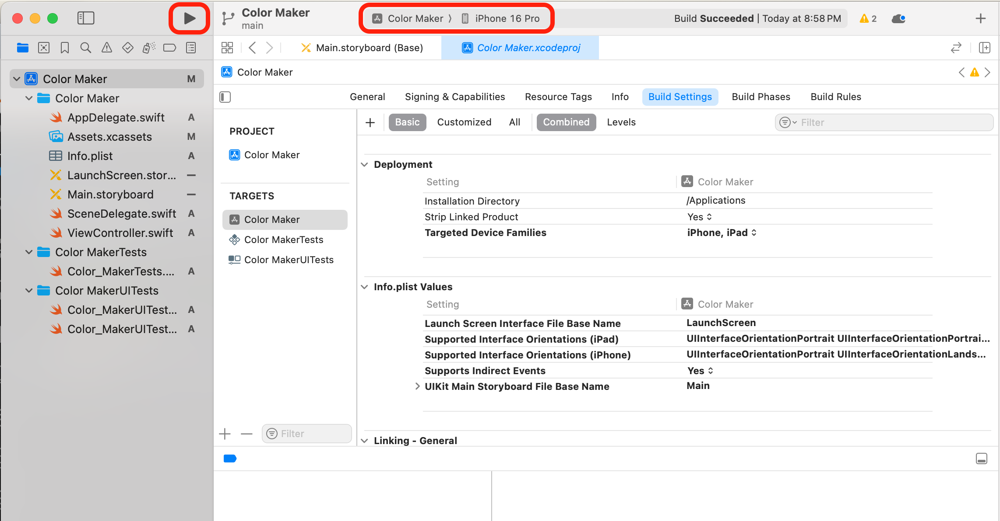

# Color Maker 
## Instructions
To run this app, navigate to your desired folder using the terminal and run `git clone <cloned-github-link-of-this-repo>`. This will clone the repository.

Open up Xcode. Click on "Open Existing Project". Navigate to the folder "color-picker -> Color Maker" and click open. 

Choose a device to run the code on using the top bar. Run the code by pressing the triangle "run" button in the top bar.

# My Information
* Name: Angel Cervantes
* Email: angel.lyn.cervantes@gmail.com
